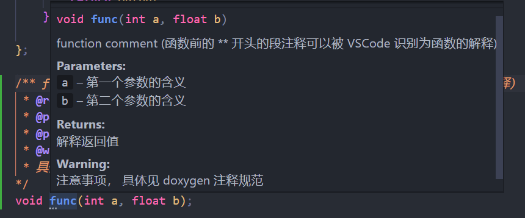

# 更新日志

## 2023.5.25 - 5.26 

huangyj - 主要重构了 `transfer.h` 中的 `sparce_matrix` 类，当前代码可以跑，但注释了 `cgemm` 等相关代码因为其他部分还要跟着改。当前的 `sparce_matrix` 类算是比较完善了，但测试还在进行中，如果 改动不合理 / 补充改动 请沟通

- 代码规范

  - 尽量使用 `const uint` 而不是 `cui` ，`const` 具有很强的语义指示性；如果是简单函数且是原始数据类型 `uint, bool` ，其实可以直接不用 `const`

  - 注释格式请按照如下方式，多多使用空格，中文和英文数字之间尽量隔开

    ```c
    // A blank after the '//'
    my_code;  // This is my comment, two blanks between the code and the "//"
              // 这是我的 comment 但是中英混杂版
    ```

    （huangyj 本地注释的高亮是斜体的，中英文倾斜不同，混用时会稍微叠在一起比较难读）

    函数注释可以这样写：

    ```c
    /** function comment (函数前的 ** 开头的段注释可以被 VSCode 识别为函数的解释) 
     * @return 解释返回值
     * @param a 第一个参数的含义
     * @param b 第二个参数的含义
     * @warning 注意事项
     * 具体见 doxygen 注释规范
    */
    void func(int a, float b);
    ```

    VS Code 识别：

    

  - 都用 C++ 的面向对象了，多用引用呗

  - 不要使用 `using namespace std;` ，这在写小程序时是图方便，如果之后要自行实现 swap，vector 时就麻烦了

- 内存管理

  - `vector` 对象本身不需要开在堆内存上，内置数组无论如何都是在堆上，而容器对象本身直接放在矩阵类里即可，都是自动初始化不用管

    ```cpp
    class ... {
        vector<uint> correct;
        vector<uint>* no_need;
    }
    ```

  - 函数内的临时对象也是开在局部栈上就好了，对象内容跳转到堆内存反而会慢
    

- 面向对象

  我们的矩阵类应该把语义做清晰，面向用户，然后在此基础上再做运算库

  - 加入了 col_size
    - 不允许只使用 rows 初始化一个空矩阵

  - `sparce_matrix` 类的 `trans` 成员改名为 `csr` 

    - transpose 是数学操作，作用在类对象时可以改变数据，也可以不改变数据而只改变 csr / csc 存储格式，二者的命名不应该绑定

      > 这两个不如叫 `transpose` 和 `quick_transpose` ？

    - 矩阵类对象应该忠于自己表示的内容，而使用 `trans` 在语义上是在表示对象是另一个数值矩阵对象的转置，这会需要用户了解一个矩阵可能并不代表自身

  - 为了更好地适应 CSC, CSR 的类型，压缩的 range 数组 和 索引数组，应该命名为 outer 和 inner，与 row-col 解耦：

    ```c++
    <tp>
    struct sparce_matrix {
        uint inner_size;
        uint outer_size;
        uint* inner_index;  // inner_indices[i] 是 data[i] 的行号（列号）
        uint* outer_start;  // outer_starts[j] 是第 j 列（行）的首个元素的索引
        tp* data;
    }
    ```

    目前成员名字还没改，但是添加了宏替换，特定函数实现时使用 inner-outer 更舒服：

    ```c
    #define outer_size col_size
    #define inner_size row_size
    #define outer_range col_range
    #define inner_index row_index
    ```

    这样的话 cols 和 rows 的含义也要改变：

    ```c
    	uint cols() const {
    		if (csr) return inner_size;
    		else     return outer_size;  // col_range->size() - 1;
    	}
    	uint rows() const {
    		if (csr) return outer_size;  // col_range->size() - 1;
    		else     return inner_size;
    	}
    ```

  - `transpose` 操作将会使矩阵变为另一个数学对象，如果只是想改变数据组织形式应该叫 `convert_compress` / `reformat` / `convert_fomat` 

    - 重构后完全分离了 CSC-CSR 和 transpose

  - `append_col` 没看懂是在干什么，改成 `append_outer` 改了一半干脆注释了

- CMake 加入了架构的检测，不在板子上跑的时候就不进行 kernel test

